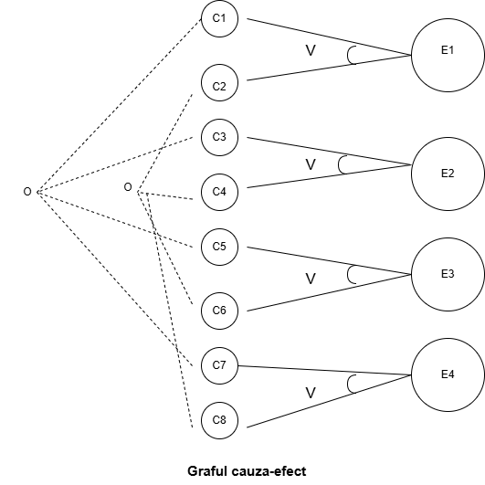
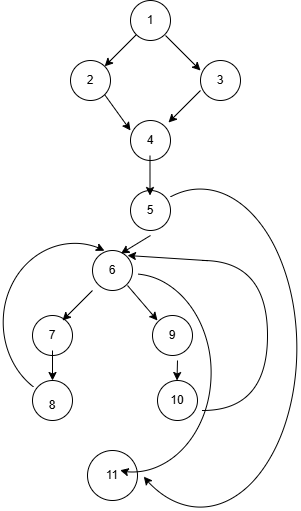
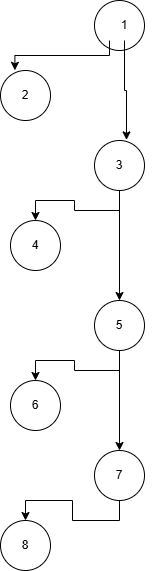

# Proiect Testarea Sistemelor Software
Aplicatie web pentru managementul amenintarilor de securitate cibernetica - Modul de calcul 'RiskScorer'

Proiectul abordeaza o testare unitara completa in limbajul Python , utilizand framework-ul 'pytest' si modulul pentru testarea de mutanti 'mutatest'.
Sistemul ia in calcul doi parametri a caror valori provin din baze de date externe: severitatea si istoricul incidentelor. Parametrul severitate (acceptand valorile valide 'critical', 'high', 'medium' si 'low') indica impactul vulnerabilitatii si este preluat in mod automat de la un scanner de securitate (OpenVAS) sau din baza internationala de vulnerabilitati (NVD).Istoric_incidente aduce contextul specific al organizatiei; acest parametru (reprezentat prin liste de tipul ['breach'], ['malware'] sau o lista goala []) este extras direct din baza de date interna si avertizeaza sistemul daca echipamentul afectat are deja un istoric de securitate compromis, aplicand penalizari suplimentare in calculul final.

## Mediu de testare si Configuratii

Testarea sistemului a fost realizata folosind urmatoarele configuratii si programe:

### Configuratia Hardware
Sistem de operare: Windows 11 (64-bit)
Procesor (CPU): Intel I7 x64
Memorie RAM: 24 GB
Mediu de stocare: SSD

### Configuratia Software si Versiuni Tool-uri
Limbaj de programare: Python 3.14.3
IDE: Visual Studio Code
Framework de testare unitara: 'pytest' versiunea 9.0.3 [1]
Sistem de versionare: GitHub
Testare mutanti: 'mutatest'  - rulat prin linia de comanda [2]

Testarea a fost realizata nativ, direct pe sistemul de operare gazda (Windows). Nu am utilizat o masina virtuala (VM) sau containere (ex. Docker) deoarece componentele testate sunt clase izolate.

### Strategii
Strategiile de testare aplicate sunt de tip black-box si white-box, de asemenea am efectuat testul pentru mutanti cu 'mutatest'. Suita completa de teste este disponibila in fisierul 'test_scor_risc.py' din acest repository.

## 1. Testarea functionala (Black-Box)

### 1.1 Partitionarea in clase de echivalenta (EC)

UNITATEA 1(U1): calculeaza_risk_score
1. Domeniul de intrari
*cvss_score* — exista constrangere implicita [0.0, 10.0]:
N1 cvss < 0.0; N2 cvss = 0.0;  N3 0.0 < cvss ≤ 10.0; N4 cvss > 10.0, N5 None - programul nu are protectie si va da crash;
*zona_retea*:
Z1'external' 1.5; Z2 'DMZ' 1.3; Z3 'internal'1.0; Z4 valoare nerecunoscuta (ex. 'cloud'); Z5 None
*importanta_business*:
B1 'critica' 1.5; B2 'mare' 1.3; B3 'medie' 1.1; B4 'scazuta' 1.0; B5 valoare nerecunoscuta; B6 None
*severitate*:
S1 'critical' 1.4;  S2 'high' 1.2; S3 'medium' 1.1; S4 'low' 1.0; S5. valoare nerecunoscuta, 1.0; S6 None 1.0
*istoric_incidente*:
I1 []0 (lista goala e falsy); I2 ['breach']+1.5; I3 ['malware']+0.5; I4 ['breach', 'malware']+2.0 (acumulat); I5['ceva_necunoscut']0 (tip necunoscut); I6 None 0 (if sarit)
2. Domeniul de iesiri
Functia returneaza un float. Exista 2 tipuri de raspuns:
O1 scor = 0.0 cvss negativ sau zero; O2 0.0 < scor ≤ 10.0 cvss valid pozitiv, sau cvss>10, cu min()
3. Clase globale
Numarul de combinari posibile ar fi 5x5x6x6x6 = 5400. Ca sa restrangem numarul de cazuri, aplicam anumite constrangeri, cum ar fi: fiecare clasa individuala sa apara in cel putin o clasa globala, fiecare combinatie de clase din parametri diferiti sa apara cel putin o data, fiecare iesire produsa de cel putin 2 combinatii de intrare diferite, etc.
Cea mai restransa varianta e cea in care fiecare clasa individuala trebuie sa apara cel putin o data.
astfel o sa avem: 
G1 = N1 x Z1 x B1 x S1 x I6 = O1
G2 = N2 x Z2 x B2 x S2 x I1 = O1
G3 = N3 x Z1 x B3 x S3 X I2 = O2
G4 = N4 x Z3 x B4 x S4 X I3 = O2
G5 = N3 x Z4 x B5 x S5 X I4 = O2
G6 = N1 x Z5 x B6 x S6 X I5 = O2
G7 = N3 x Z2 x B3 x S4 x I3 = O2

### 1.2 Analiza valorilor de frontiera (BVA)
La analiza valorilor de  frontiera, am testat cvss_score si risk_score, deoarece au valori numerice. La cvss_score, avand valori intre 0.00 si 10.00, avem valorile: -0.01, 0,00, 0.01, 10.0, 10.01
La risk_score, avand valorile: >= 9.00, >= 7.00, >= 4.00, <4.00, astfel alegem:9.00, 8.99, 6.99, 7.00, 3.99, 4.00

### 1.3 Partitionarea in categorii (Category-Partitioning)

Aplicarea Metodei Category-Partitioning (Partitionarea in Categorii)
1. Am descompus specificatia in unitati: avem 2 unitati(functii) - U1 - metoda principala de calcul al scorului calculeaza_risk_score() si U2 - cea de generare a recomandarilor genereaza_recomandare().

2. Identificarea parametrilor: U1: cvss, zona_retea, importanta_business, severitate, istoric, U2: risk_score, severitate

3. Gasirea de categorii:

cvss: <0, 0, pozitiv in intervalul valid (0.1 - 10.0) sau >10.0

zona_retea: external, DMZ, internal, nerecunoscuta sau valoare lipsa

importanta_business: critica, mare, medie, scazuta, o valoare oarecare sau lipsa

severitate: critical, high, medium, low, valoare oarecare sau valoare lipsa

istoric: lista goala[],['malware'], ['breach']  sau ['element_necunoscut].

4. Partitionarea fiecarei categorie in alternative:

cvss: < 0.0, 0.0, 0.1..10.0, >10.0, None

zona_retea: 'external', 'DMZ','internal', (invalid)'cloud', None

importanta_business: 'critica', 'mare','medie', 'scazuta', (invalid)'necunoscut', None

severitate: 'critical','high','medium','low', (invalida) 'orice', None

istoric: [] (lista goala), ['breach'], ['malware'], ['breach', 'malware'],(invalid) ['ceva necunoscut'], None

5. Specificatia de testare (cu adaugarea constrangerilor):

cvss:
  A1 {cvss < 0.0}      [scor_zero_fortat]
  A2 {cvss = 0.0}      [scor_zero]
  A3 {0.0 < cvss <=10} [ok]
  A4 {cvss > 10.0}     [peste_limita]

zona:
  B1 'external'      [if ok or peste_limita]
  B2 'dmz'           [if ok or peste_limita]
  B3 'internal'      [if ok or peste_limita]
  B4 invalid         [if ok or peste_limita]
  B5 None            [if ok or peste_limita]

business:
  C1 'critica'       [if ok or peste_limita]
  C2 'mare'          [if ok or peste_limita]
  C3 'medie'         [if ok or peste_limita]
  C4 'scazuta'       [if ok or peste_limita]
  C5 invalid         [if ok or peste_limita]
  C6 None            [if ok or peste_limita]

severitate:
  D1 'critical'      [if ok or peste_limita]
  D2 'high'          [if ok or peste_limita]
  D3 'medium'        [if ok or peste_limita]
  D4 'low'           [if ok or peste_limita]
  D5 invalid         [if ok or peste_limita]
  D6 None            [if ok or peste_limita]

istoric:
  E1 []              [if ok or scor_zero or scor_zero_fortat]
  E2 ['breach']      [if ok or scor_zero or scor_zero_fortat]
  E3 ['malware']     [if ok or scor_zero or scor_zero_fortat]
  E4 ['breach','malware'] [if ok or scor_zero or scor_zero_fortat]
  E5 [necunoscut]    [if ok or scor_zero or scor_zero_fortat]
  E6 None            [if ok or scor_zero or scor_zero_fortat]
Nr. total cazuri posibile: 5 x 5 x 6 x 6 x 6 = 5400 

6. Cazuri de testare (selectie reprezentativa a combinatiilor):
a se vedea part2 din tabele_proiect.pdf

7. Date de test (Tabel cu o selectie a datelor finale):
a se vedea part2 din tabele_proiect.pdf
## 2. Testare functionala - Metoda grafului cauza - efect

Am aplicat aceasta metoda pentru U2, functia genereaza_recomandare().
Avem urmatoarele cauze: C1 - risk_score >= 9; C2 - severitate = 'critical'; C3 - risk_score >= 7.00; C4 - severitate = 'high'; C5 - risk_score >= 4.00; C6 - severitate = 'medium'; C7 - risk_score < 4.00; C8 - severitate = 'low'
Efecte: E1 - prioritate 1; E2 - prioritate 2; E3 - prioritate 3; E4 - prioritate 4

## 3. Testarea structurala - Metoda grafului de control al fluxului (CFG)
Mai jos am realizat diagramele CFG separat pentru cele 2 metode ale clasei.

Metoda calculeaza_risk_score

Metoda genereaza_recomandare

## 5. Bibliografie
[1] https://docs.pytest.org/en/stable/index.html, Data accesarii: 6 mai 2026
[2] https://mutatest.readthedocs.io/en/latest/, Data accesarii: 7 mai 2026
[3] Predut, Sorina-Nicoleta, 1. Functional Testing (1,2), Suport de curs, 2025-2026.
[4] https://app.diagrams.net/, Data accesarii 11 mai 2026
[5] https://nvlpubs.nist.gov/nistpubs/Legacy/SP/nistspecialpublication800-30r1.pdf, pag. 85-87, Data accesarii: 7 mai 2026

